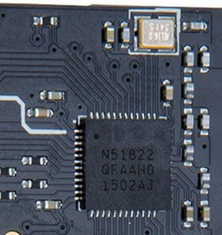
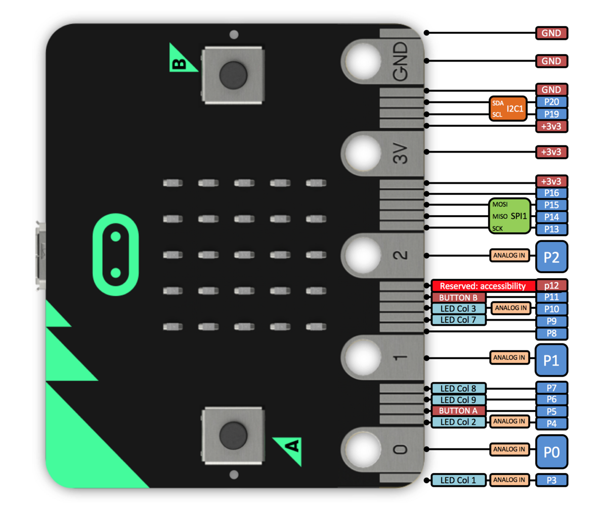

# The BBC micro:bit
Copyright © 2024 J. M. Spivey
[Mark van der Wilk]: I have included the material that is most relevant to the course here. [Mike Spivey's micro:bit page](https://spivey.oriel.ox.ac.uk/corner/The_BBC_micro:bit_(Digital_Systems)) has more details, and information on the peripherals. I recommend browsing it to gain an awareness of what else is out there. If you are interested in doing some things beyond the labs, it contains invaluable information on other peripherals.

This page is Grand Central for micro:bit hardware documentation. I have tried to include a copy of every document I used in developing the course, or at least a link to it.

The micro:bit is best thought of as a system with three layers:
- The processor core is a Cortex-M0 developed by ARM.
- The microcontroller chip, an nRF51822 developed by Nordic Semiconductor, extends the core with a collection of peripheral interfaces.
- The micro:bit board, developed for the BBC, adds external components like buttons, lights, and an accelerometer and magnetometer on an I2C bus.

This page contains exclusively documentation of the micro:bit itself: for information on the tool setup for programming it, see the labs page and other pages linked to it.

## Processor core
The Cortex-M0 core is an ARM processor, with sixteen 32-bit registers and a RISC-style instruction set. Like other microcontroller-oriented versions of the ARM, it omits the standard 32-bit encoding of the instruction set, and executes only programs written in the more compact 16-bit Thumb encoding.

- [ARM architecture reference manual](ARM-ARM-V6m.pdf) for ARM-V6m, describing the Cortex-M0 instruction set ([source](http://infocenter.arm.com/help/topic/com.arm.doc.ddi0419d/DDI0419D_armv6m_arm.pdf)).
- [A chart](rainbow-chart.pdf) showing Thumb instruction encodings. To use this chart, begin with table [A] in the top left, and find the entry identified by the first hexadecimal digit of the instruction at the left, and the second digit at the top. This will either identify a specific instruction, with assembly language syntax given at the right of the table, or give you a reference to one of the other tables [B] to [E]. In each table, the first hex digits of the instruction are shown to the left to the table, and sometimes a further digit at the top. The notation r1 or r2 denotes a low register, one of r0 to r7, while r/h1 denotes any register, including r8 to r12, sp, lr, pc. The notation #4*imm8 denotes an 8-bit immediate field whose (unsigned) value is multiplied by 4 – so it can express the values 0, 4, 8, ..., 1020. All immediate fields are unsigned, and all branch displacements are signed.
- [A list of common instructions](rainbow-chart.pdf) that will be provided as part of the exam paper.
  - This is similar to the [Quick reference card](ARM-Thumb-QRC.pdf) that ARM provides. ([source](http://infocenter.arm.com/help/topic/com.arm.doc.qrc0006e/QRC0006_UAL16.pdf)).
- [Generic user guide for Cortex-M0](Cortex-M0-generic-ug.pdf) ([source](http://infocenter.arm.com/help/topic/com.arm.doc.dui0497a/DUI0497A_cortex_m0_r0p0_generic_ug.pdf)).
- [Technical reference manual](Cortex-M0-tech-ref.pdf) for Cortex-M0 ([source](http://infocenter.arm.com/help/topic/com.arm.doc.ddi0432c/DDI0432C_cortex_m0_r0p0_trm.pdf)).
- Geoffrey Brown's [notes](https://spivey.oriel.ox.ac.uk/wiki/images-corner/a/a9/Geoffrey-Brown-notes.pdf) for a course similar to this one at Indiana University ([source](https://www.cs.indiana.edu/~geobrown/c335book.pdf)).

## Microcontroller chip

The [nRF51822](https://www.nordicsemi.com/eng/Products/Bluetooth-low-energy/nRF51822) contains an implementation of the processor core that runs with a 16MHz clock, together with 16kB of RAM and 256kB of read-only flash memory.  It also contains several peripheral interfaces, including a UART, bus interfaces for I2C and SPI, a hardware random number generator, and a 2.4GHz radio interface.  The processor has the single-cycle multiplier option.
- [Product specification](NRF51822-product-spec.pdf) for the nRF51822, containing the mechanical and electrical parts of the datasheet ([source](http://infocenter.nordicsemi.com/pdf/nRF51822_PS_v3.1.pdf)).
- [Reference manual](NRF51822-ref-manual.pdf) for the nRF51822, containing detailed programming information for the peripheral interfaces ([source](http://infocenter.nordicsemi.com/pdf/nRF51_RM_v3.0.pdf)).
- A sneak peek at the [nRF58122 die](https://spivey.oriel.ox.ac.uk/corner/NRF51822_die_shot_(Digital_Systems)).

## micro:bit board
The micro:bit board adds connections and external devices to the nRF51822 chip. A [schematic](True-microbit-schematic.pdf) is available, and also a more colourful [schematic](https://spivey.oriel.ox.ac.uk/wiki/images-corner/5/5b/Microbit-schematic.pdf "Microbit-schematic.pdf") for a reference design. In this course, we will use the following peripherals:
- 25 LEDs, arranged in a 5x5 matrix. Electrically, the 25 LEDs are wired as a matrix with three rows and up to nine LEDs in each row, in a seemingly irregular pattern. Only one row can be used at a time, so displaying an arbitrary image requires patterns in the three rows to be illuminated in rapid succession, under processor control.
- two tactile switches, labelled A and B.
- a UART interface, connected to a host computer via USB.

There are more, as described on [Mike Spivey's micro:bit page](https://spivey.oriel.ox.ac.uk/corner/The_BBC_micro:bit_(Digital_Systems)).

